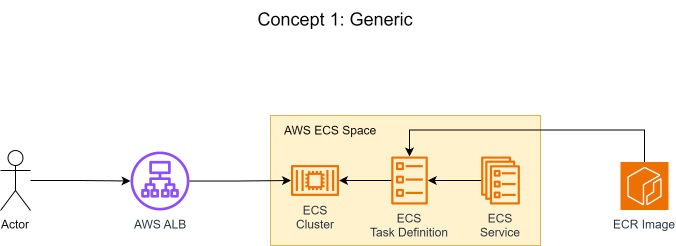
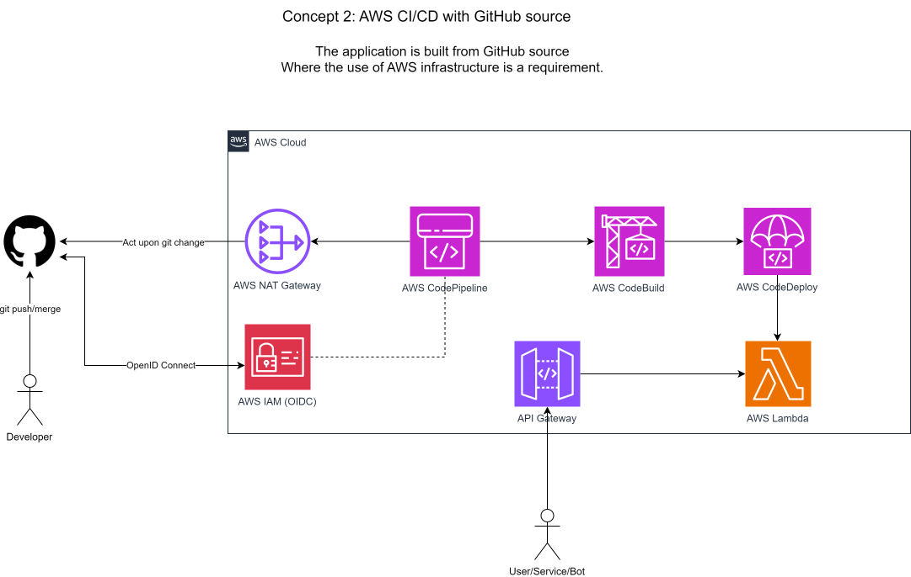
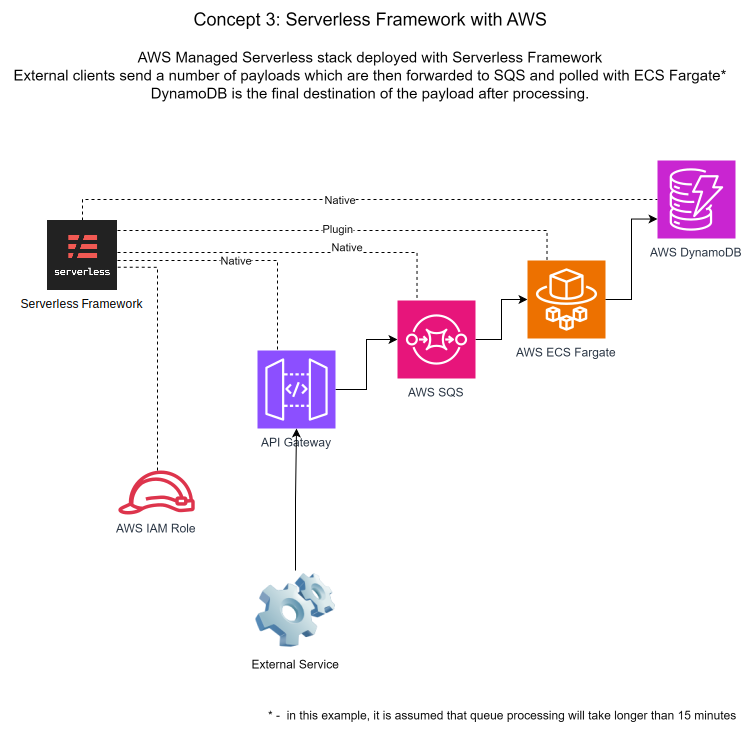

# Appsilon Homework
Homework project for Appsilon

## Assignment 1: R Shiny App [](https://github.com/vazome/appsilon-homework/actions/workflows/build_shiny_docker.yml)

Per assignment, the environment has been created to build an R Shiny application with Docker and GitHub CI/CD. The image could have been sourced from either [r-base](https://hub.docker.com/_/r-base) or [rocker/shiny](https://hub.docker.com/r/rocker/shiny) up to one's compliance requirement in regards to official image usage. I sticked with latter due to no requirement while keeping default build platform linux/amd64.

Related configurations available at [shiny-app](./shiny-app) and [build_shiny_docker.yml](.github/workflows/build_shiny_docker.yml).


## Assignment 2: Ansible Configuration [](https://github.com/vazome/appsilon-homework/actions/workflows/ansible_lint.yml)

Both the playbook and the script were pushed to the submodule path `plat-eng-task-starter/` which was forked from Appsilon's example repo. 

The `playbook.yml` contains comments to guide a possible reader through the configuration process.

This is how you launch the playbook with `ansible-playbook`, note that you must provide a list of target hosts either as a file or inline.
``` yaml
ansible-playbook playbook.yml -i ansible_hosts 
```

## Assignment 3: Theoretical Environment
A simple concept which barebones outlines how would a potential user interact with a cloud based application. 

___
A bit more complex concept which takes into account application development stage of an application and its automated deployment.

___
An enterprise focused concept which offloads serverless infrastructure deployment to the Serverless Framework.

___
**Bonus**: My pet project's [redbull-tracker-ge](https://github.com/vazome/redbull-tracker-ge) diagram
